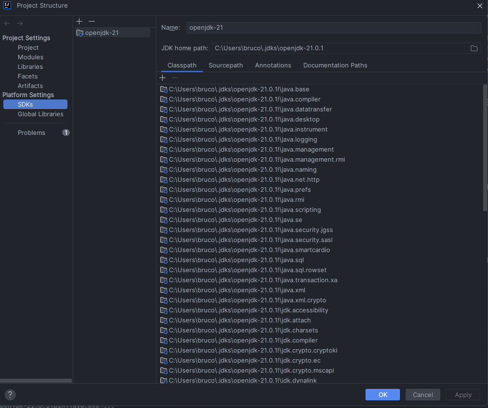

# Tiki Taka Toe Game Client application

## Overview
This is the client-side implementation of the Tiki Taka Toe game for remote gaming version. 
The client features a graphical user interface (GUI) for users to interact with the game.
It communicates with the server using the TCP/IP transport protocol to exchange game-related information.

## Features
- Graphical user interface using Java Fx.
- Communicates with the Tiki Taka Toe game server using TCP/IP.
- Displays the game board and allows players to make guesses and  talk through a chat box.
- Sends and receives updates from the server regarding the game state.

## Requirements
- Java Development Kit (JDK) installed on your system.
- IntelliJ IDEA to avoid using terminal to run the application
- Tiki Taka Toe game Server running on a specified host and port.

## How to Run
1. Clone this repository to your local machine.
   ```bash
   git clone https://git.fe.up.pt/psw_23_24/1meec_a01/a01_1.git

2. Open with IntelliJ IDEA the Client directory from the cloned project
3. Go to `file` --> `Project Structure...` and add the openJdk-21 Package available in the 
InstallationPackages directory from the project by choosing the lib subfolder


4. Run the `Client` main from the project


