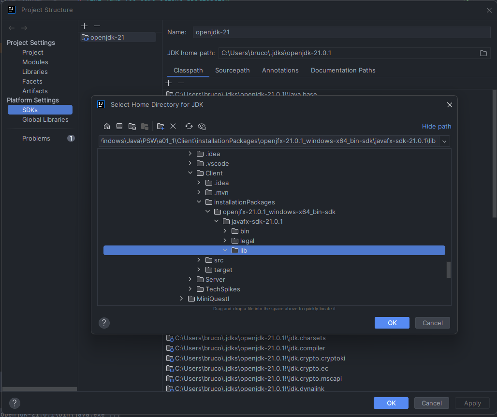
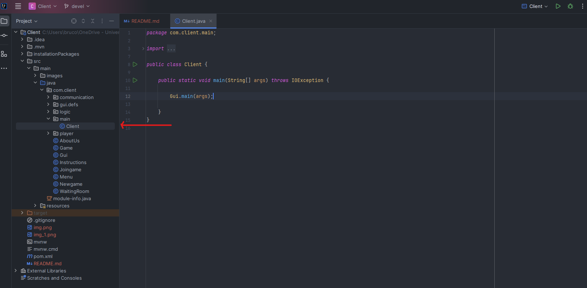
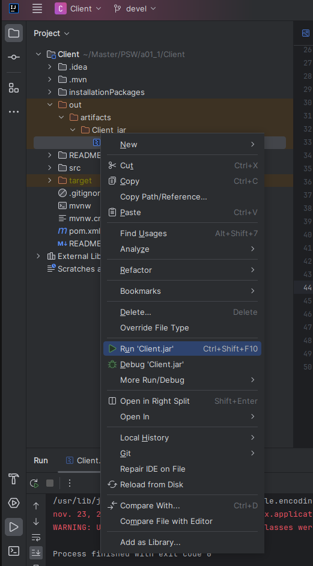
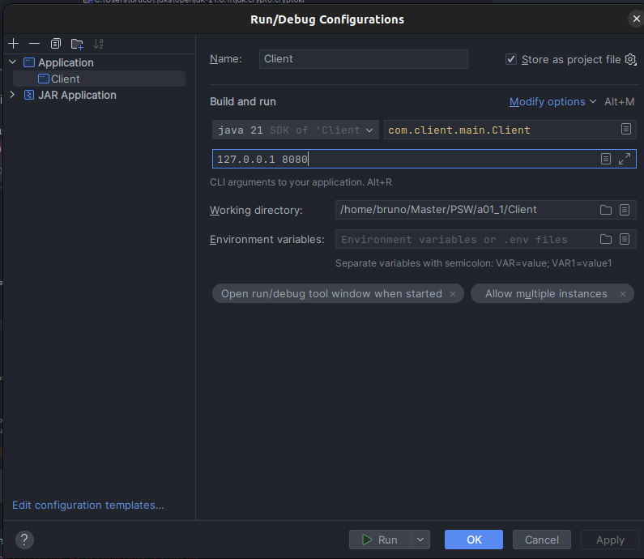
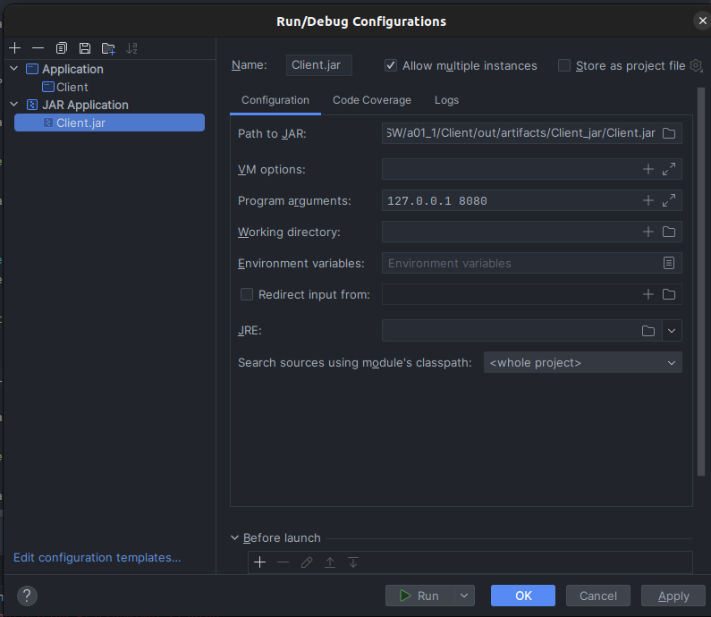

# Tiki Taka Toe Game Client Application

## Overview

This document guides you through the setup and execution of the Tiki Taka Toe game client. The client, designed for remote gaming, features a graphical user interface (GUI) allowing users to interact with the game. Communication with the server occurs via the TCP/IP transport protocol to exchange game-related information.

## Features

- Graphical user interface implemented in JavaFX.
- TCP/IP communication with the Tiki Taka Toe game server.
- Game board display, enabling players to make guesses and communicate through a chat box.
- Real-time updates from the server regarding the game state.

## Requirements

- Windows OS (Linux is supported but may exhibit GUI deformations).
- Java Development Kit (JDK) installed on your system.
- IntelliJ IDEA (recommended but not mandatory).
- Tiki Taka Toe game server running on a specified IP and port.

## How to Run

### Option 1: Using IntelliJ IDEA

1. Clone this repository to your local machine.
   ```bash
   git clone https://git.fe.up.pt/psw_23_24/1meec_a01/a01_1.git
   cd a01_1/Client


2. Open with IntelliJ IDEA the `/Client` directory from the cloned project


3. Go to `file` --> `Project Structure...` and add the openJdk-21 Package available in the
   `/InstallationPackages` directory from the project by choosing the `lib` subfolder (Sometimes already loaded)

   
   

   If not loaded the SDks will be empty


   


4. Create an Aplication Run/Debug configuration and add the following VM option to the project 
   configuration `--add-exports javafx.base/com.sun.javafx.event=org.controlsfx.controls`

   


5. Change the IP and Port in the Programs Arguments for the required ones

   
                                                                                          

6. Run the `Client` main from the project


### Option: 2 Executable jar file


1. Clone this repository to your local machine.
   ```bash
   git clone https://git.fe.up.pt/psw_23_24/1meec_a01/a01_1.git
   cd a01_1/Client


2. Create a Jar file Run/Debug configuration and the following VM option `--add-exports javafx.base/com.sun.javafx.event=org.controlsfx.controls`

   The project jar file is inside the `/out/artifacts/Client_jar` directory

   
   

3. Change the IP and Port in the Programs Arguments for the required ones

   


4. Run the `Client.jar` file


